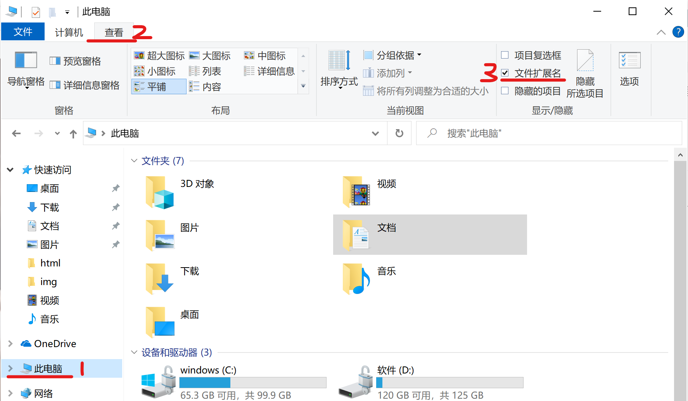
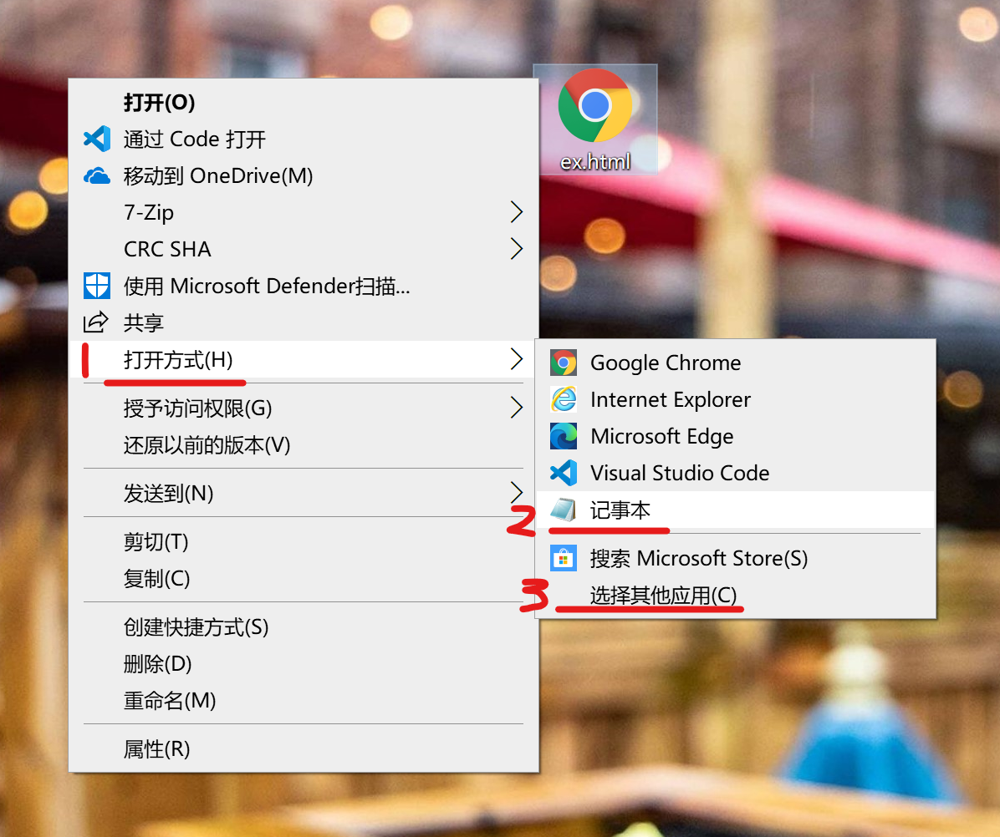
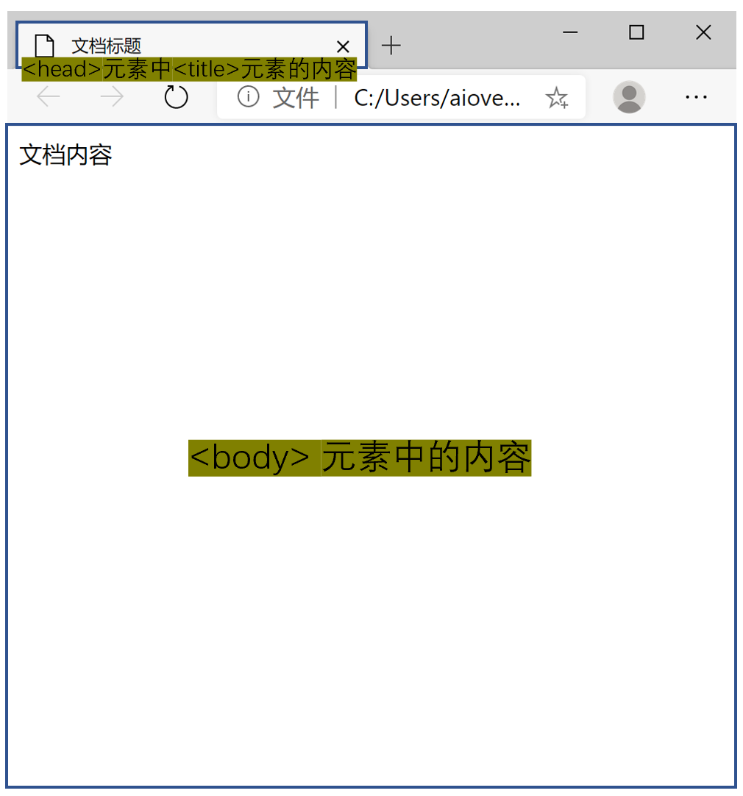

# 如何创建一个HTML文档

创建一个HTML文档很简单，大致分为以下几步：

- 第一步：创建文件。

  创建一个以 `.html` 为后缀的文件，以在 Windows 系统中为例，先创建一个 名为 `ex.txt` 的文本文档，注意这里要先设置 显示文件扩展名，否则看不到文件后缀的 `.txt` ， 然后将 `.txt` 改为 `.html` ，这样我们就得到了一个名为 `ex.html` 的文件，这个文件就是 HTML 文档。

  在 Windows 系统中显示文件扩展名的方法如下：

  在 `此电脑` 中的 `查看` 中的 `文件扩展名` 选项上打勾就可以开启显示文件扩展名了，如图：

  

- 第二步：以可编辑的状态打开文件。

  由于修改了文件扩展名，双击打开时，`.html` 后缀的文件一般会默认使用浏览器打开，以这样的方式打开是不能文件内容进行编辑的，所以先使用 window 的记事本打开文件，写入文件内容。打开方式如下：
  
  选中文件，点击鼠标右键，选择 `打开方式` ，选择 `记事本` 打开（若 `记事本` 不在选择列表中，可以点击 `选择其他应用` ，在这里面可以找到记事本。），如图：
  
  
  
- 第三步：写入 HTML 内容。

  在 `ex.html` 文件中写入内容，然后保存文件，一个有内容的 HTML 文档就创建成功了。

  如在文档中写入以下内容：

  ```
  <!DOCTYPE html>
  <html>
    <head>
      <title>文档标题</title>
    </head>
    <body>
      文档内容
    </body>
  </html>
  ```

  文档内容中说明：

  1、 `<!DOCTYPE>` 用于声明文档使用的 HTML 版本，`<!DOCTYPE html>` 表示使用 HTML5 。

  2、`<html>` 用于声明一个 HTML 文档，一个文档中只能有一个 `<html>` 元素，除了`<!DOCTYPE>` 以外，其他的 HTML 元素都应该包裹在 `<html></html>` 中。

  3、`<head>` 用于声明文档的头部部分。

  4、`<title>` 用于声明文档的标题，`<title></title>` 中的内容会在浏览器的标签中显示，注意 `<title>` 要放在 `<head>` 元素中。

  5、`<body>` 用于声明文档的内容，`<body></body>` 中的内容会作为文档的内容显示。

- 第四步：使用浏览器打开 HTML 文档。

  使用浏览器打开刚刚创建的 `ex.html` 文档，显示如下：

  


